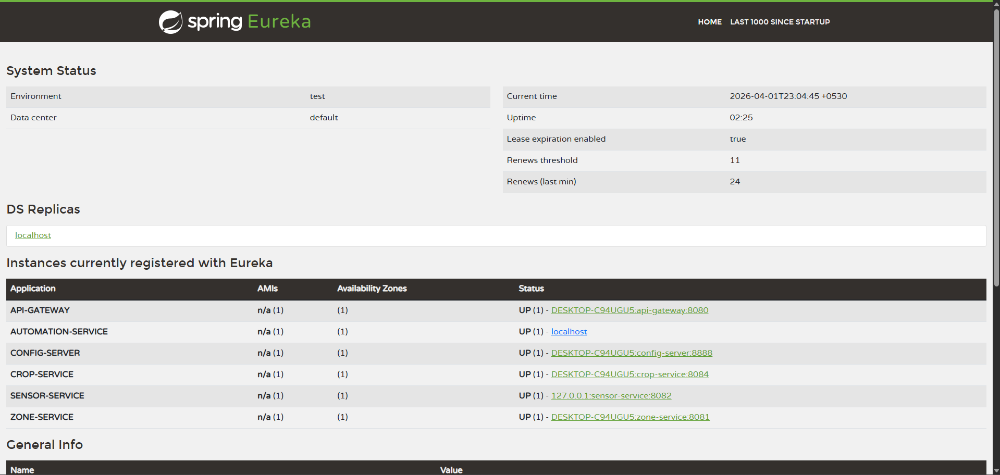
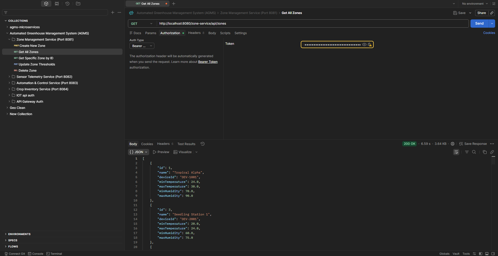
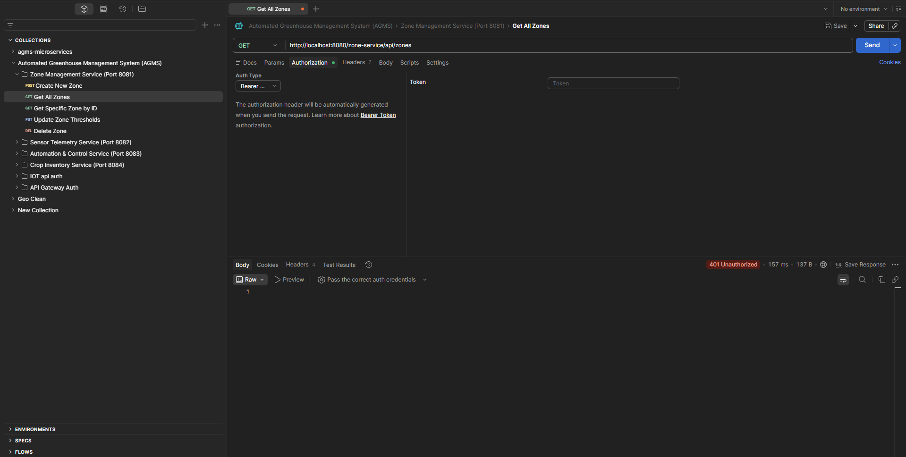

# 🌿 AGMS: Intelligent Agricultural Growth Management System
> **Enterprise-grade Microservices Platform for Greenhouse Automation**

---

## 🏗️ System Architecture
The project implements a **Cloud-Native Microservices Architecture** designed for high scalability and fault tolerance. It utilizes a centralized entry point and externalized configuration management.

### 🔌 Core Infrastructure
* **API Gateway (Port 8080):** The single entry point. Implements **JWT Security** and dynamic routing.
* **Service Discovery (Eureka, Port 8761):** Facilitates service registration and heartbeat monitoring.
* **Config Server (Port 8888):** Centralized property management using a **Git-backed repository**.

### 🛠️ Domain Services
| Service | Tech Stack | Responsibility |
| :--- | :--- | :--- |
| **Zone Service** | Java / Spring Boot | Managing environmental thresholds (Temperature/Humidity). |
| **Sensor Service** | Python / FastAPI | Integration with **External IoT API** (104.211.95.241). |
| **Automation Service** | Node.js / Express | Real-time logic execution (e.g., Fan/Irrigation control). |
| **Crop Service** | Java / Spring Boot | Lifecycle tracking (Seedling → Vegetative → Harvested). |

---

## 📊 System Status & Evidence
To verify the operational integrity of the microservices ecosystem, refer to the following system captures:

### 1. Service Discovery (Eureka Dashboard)
All polyglot services (Java, Node.js, Python) are successfully registered and monitored by the Eureka Server.

### 2. Gateway Security (JWT Validation)
**Secure Access:** Successful authorized request via Port 8080.

**Access Control:** Gateway correctly rejecting requests without a valid Bearer Token.

---

## 🔒 Security Implementation

### 1. Gateway-Level Authentication (North-South Traffic)
Strict security is enforced at the **API Gateway** layer:
* **Filter:** `JwtAuthenticationFilter` intercepts all incoming requests.
* **Validation:** `JwtUtil` verifies the signature against a **60-character high-entropy secret** stored in the Config Server.
* **Access Control:** Any request lacking a valid `Bearer Token` is rejected with a `401 Unauthorized`.

### 2. Network Isolation Strategy
> [!IMPORTANT]
> **Production Note:** In a cloud deployment (AWS/Azure), Domain Services are hosted in **Private Subnets**. Only the API Gateway is assigned a Public IP, ensuring that individual service ports are physically inaccessible from the public internet.

---

## 🚀 Getting Started

### Prerequisites
* **JDK 17+** & **Maven**
* **Node.js v18+**
* **Python 3.9+**
* **Databases:** MySQL / MongoDB (configured via Config Server)

### 🚦 Execution Order
To ensure proper service discovery and configuration fetching, start components in this order:
1. **Eureka Server** (8761)
2. **Config Server** (8888)
3. **API Gateway** (8080)
4. **Domain Services** (Zone → Sensor → Automation → Crop)

---

## 🧪 API Testing & Integration
The project includes a pre-configured Postman collection for immediate end-to-end testing.

[**🚀 Open Postman Collection**](postman-collection/Automated%20Greenhouse%20Management%20System%20(AGMS).postman_collection.json)

**Recommended Test Flow:**
1. **Authenticate:** `POST /auth/login` (Credentials: `farmer` / `1234`).
2. **Authorize:** Copy the JWT and set it as a `Bearer Token` in Postman.
3. **Execute:** All requests **must** target `http://localhost:8080/...` to verify Gateway routing logic.

---

## 📈 Advanced Enterprise Specifications Met
* ✅ **Centralized Security:** JWT verification strictly at the Gateway.
* ✅ **Inter-Service Communication:** Synchronous calls handled via **OpenFeign**.
* ✅ **Resilience:** External IoT API integration with built-in **fallback simulation** for offline data.
* ✅ **Infrastructure as Code:** Externalized configuration managed via Spring Cloud Config.

---

## 👨‍💻 Developed By
**Charuka Hansaja**
*Full Stack Developer & SaaS Systems Engineer*
**Institute of Software Engineering (IJSE)**

---